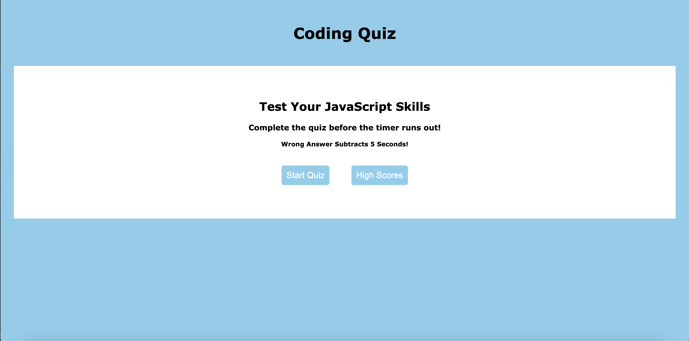

# pop-up-quiz
A JavaScript quiz

## Description
I needed more time on this assigment to work out my styling issues and continue editing my JS. I am submitting what I have currently but plan to resubmit this assignment. 

- My motivation for this assigment was to combine what I had learned in JS in addition to what I have learned about APIs. The final product was supposed to be a pop-up quiz with a working timer and questions.

## Usage

https://kelsieszost.github.io/pop-up-quiz/

https://github.com/kelsieszost/pop-up-quiz 

## License
MIT License

Copyright (c) 2022 Kelsie Szost

Permission is hereby granted, free of charge, to any person obtaining a copy of this software and associated documentation files (the "Software"), to deal in the Software without restriction, including without limitation the rights to use, copy, modify, merge, publish, distribute, sublicense, and/or sell copies of the Software, and to permit persons to whom the Software is furnished to do so, subject to the following conditions:

The above copyright notice and this permission notice shall be included in all copies or substantial portions of the Software.

THE SOFTWARE IS PROVIDED "AS IS", WITHOUT WARRANTY OF ANY KIND, EXPRESS OR IMPLIED, INCLUDING BUT NOT LIMITED TO THE WARRANTIES OF MERCHANTABILITY, FITNESS FOR A PARTICULAR PURPOSE AND NONINFRINGEMENT. IN NO EVENT SHALL THE AUTHORS OR COPYRIGHT HOLDERS BE LIABLE FOR ANY CLAIM, DAMAGES OR OTHER LIABILITY, WHETHER IN AN ACTION OF CONTRACT, TORT OR OTHERWISE, ARISING FROM, OUT OF OR IN CONNECTION WITH THE SOFTWARE OR THE USE OR OTHER DEALINGS IN THE SOFTWARE.

